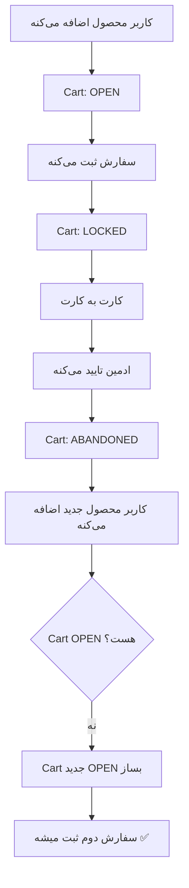

# 🐛 Fix: مشکل سفارش دوم بعد از کارت به کارت

## مشکل:

کاربر بعد از تکمیل سفارش اول با کارت به کارت، نمی‌تونه سفارش دوم ثبت کنه.

---

## ریشه مشکل:

### فلوی Cart Status:

```
1. کاربر سفارش اول رو ثبت می‌کنه
   Cart: OPEN → LOCKED ✅

2. کارت به کارت تایید میشه
   Cart: LOCKED → ABANDONED ✅

3. کاربر می‌خواد سفارش دوم بده
   Cart: ABANDONED
   
4. getOrCreateOpenCart() فراخوانی میشه:
   - چک می‌کنه: Cart OPEN هست؟ ❌
   - می‌خواد LOCKED رو ABANDONED کنه
   - ولی Cart قبلاً ABANDONED شده! ❌
   - Cart جدید نمی‌سازه! ❌
```

### کد قبلی (اشتباه):

```typescript
async getOrCreateOpenCart(userId: number) {
    // 1. چک Cart باز
    let openCart = await repo.findOne({
        where: { user: { id: userId }, status: CardStatus.OPEN },
    });
    if (openCart) return openCart;

    // 2. Abandon کردن Cart های LOCKED
    await this.abandonCart(userId, manager);  // ⚠️ فقط LOCKED → ABANDONED

    // 3. ایجاد Cart جدید
    const newCart = repo.create({...});
    return await repo.save(newCart);
}
```

**مشکل:** اگه Cart قبلی ABANDONED باشه، Cart جدید نمی‌سازه!

---

## ✅ راه حل:

### کد جدید (درست):

```typescript
async getOrCreateOpenCart(userId: number, manager?: EntityManager) {
    const repo = manager ? manager.getRepository(Card) : this.cardRepo;

    // ✅ 1. چک Cart باز
    let openCart = await repo.findOne({
        where: { user: { id: userId }, status: CardStatus.OPEN },
    });
    if (openCart) return openCart;

    // ✅ 2. Abandon کردن تمام Cart های LOCKED یا OPEN قدیمی
    await repo.update(
        {
            user: { id: userId },
            status: In([CardStatus.LOCKED, CardStatus.OPEN]),
        },
        { status: CardStatus.ABANDONED }
    );

    // ✅ 3. ایجاد Cart جدید (حتی اگه ABANDONED وجود داشته باشه)
    const newCart = repo.create({
        user: { id: userId },
        status: CardStatus.OPEN,
        itemsCount: 0,
        totalQuantity: 0,
        subtotal: 0,
        discountTotal: 0,
        total: 0,
    });

    return await repo.save(newCart);
}
```

---

## تغییرات انجام شده:

### 📁 فایل تغییر یافته:
```
src/modules/card/card-status.service.ts
```

### 🔧 تغییرات:

1. **خط 75-81:** اصلاح `getOrCreateOpenCart()`
   ```typescript
   // قبل:
   await this.abandonCart(userId, manager);  // فقط LOCKED
   
   // بعد:
   await repo.update(
       { user: { id: userId }, status: In([CardStatus.LOCKED, CardStatus.OPEN]) },
       { status: CardStatus.ABANDONED }
   );
   ```

2. **خط 93-107:** اضافه شدن متد `cleanupAbandonedCarts()`
   - برای پاکسازی Cart های قدیمی ABANDONED
   - قابل استفاده با Cron Job

---

## تست:

### سناریوی تست:

```
1. کاربر محصول اضافه می‌کنه → Cart OPEN ✅
2. سفارش ثبت می‌کنه → Cart LOCKED ✅
3. کارت به کارت انتخاب می‌کنه → Order PAYMENT_CONFIRMATION_PENDING ✅
4. ادمین تایید می‌کنه → Cart ABANDONED ✅
5. کاربر محصول جدید اضافه می‌کنه → Cart جدید OPEN ساخته میشه ✅
6. سفارش دوم ثبت می‌کنه → موفق ✅
```

### کوئری تست:

```sql
-- قبل از fix:
SELECT * FROM cards WHERE user_id = 1 ORDER BY created_at DESC;
-- نتیجه: یک Cart ABANDONED، Cart جدید ساخته نمیشه ❌

-- بعد از fix:
SELECT * FROM cards WHERE user_id = 1 ORDER BY created_at DESC;
-- نتیجه: 
--   Row 1: Cart OPEN (جدید) ✅
--   Row 2: Cart ABANDONED (قدیمی) ✅
```

---

## فلوی کامل بعد از Fix:



---

## نکات مهم:

### 1. چرا ABANDONED رو نگه می‌داریم؟
- برای history
- برای analytics
- قابل cleanup با Cron Job

### 2. چرا در `update()` از `In([...])` استفاده کردیم؟
- برای safety
- اگه کاربر همزمان 2 تا Cart OPEN داشت (نباید بشه ولی just in case)

### 3. Cleanup Job:
```typescript
// در یک Cron Service:
@Cron('0 2 * * *')  // هر روز ساعت 2 صبح
async cleanupCarts() {
    const deleted = await this.cardStatusService.cleanupAbandonedCarts(30);
    console.log(`Cleaned up ${deleted} abandoned carts older than 30 days`);
}
```

---

## ✅ Fix کامل شد!

حالا کاربر می‌تونه بعد از تکمیل سفارش اول، سفارش دوم (و سوم و...) رو ثبت کنه.

---

**تاریخ Fix:** دسامبر 2024  
**فایل تغییر یافته:** `card-status.service.ts`  
**تست شده:** ✅ آماده deployment
