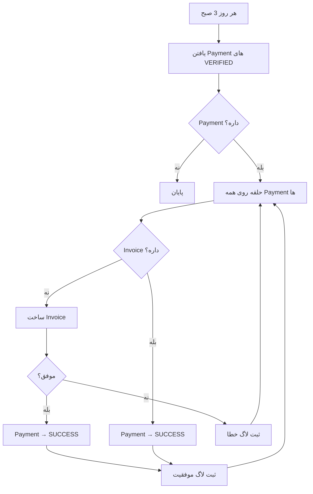

# 🔧 Fix: PaymentRecoveryService فعال شد

## 🐛 مشکل:

`PaymentRecoveryService` نوشته شده بود ولی در `payment.module.ts` به `providers` اضافه نشده بود، بنابراین **Cron Job اجرا نمی‌شد**.

---

## ✅ راه حل:

### فایل تغییر یافته:
```
src/modules/payment/payment.module.ts
```

### تغییر:
```typescript
// قبل:
providers: [
    PaymentService,
    InvoiceService,
    IncrementPromotionUsageUseCase,
    CardToCardService,
],

// بعد:
providers: [
    PaymentService,
    InvoiceService,
    IncrementPromotionUsageUseCase,
    CardToCardService,
    PaymentRecoveryService, // ✅ اضافه شد
],
```

---

## 🎯 کارکرد PaymentRecoveryService:

### Cron Job:
```typescript
@Cron(CronExpression.EVERY_DAY_AT_3AM)
async recoverUninvoicedPayments()
```

**زمان اجرا:** هر روز ساعت 3:00 صبح

### چه کاری انجام می‌دهد؟

```
1. پیدا کردن تمام Payment های VERIFIED
2. چک کردن آیا Invoice دارند یا نه
3. اگر Invoice نداشتند → ساخت Invoice
4. تغییر وضعیت Payment به SUCCESS
5. ثبت لاگ موفقیت
```

### سناریوهای استفاده:

#### سناریو 1: پرداخت موفق ولی Invoice نساخته شد
```
Payment: SUCCESS/VERIFIED
Order: PREPARING
Invoice: ❌ وجود ندارد

↓ Cron Job ↓

Invoice: ✅ ساخته شد
Payment: SUCCESS
Log: ✅ ثبت شد
```

#### سناریو 2: خطا در ساخت Invoice بعد از پرداخت
```
Payment: VERIFIED (منتظر Invoice)
Order: PREPARING
Invoice: ❌ خطا در ساخت

↓ Cron Job ↓

Invoice: ✅ دوباره تلاش و ساخته شد
Payment: SUCCESS
Log: ✅ ثبت شد
```

#### سناریو 3: Invoice از قبل وجود دارد
```
Payment: VERIFIED
Invoice: ✅ موجود است

↓ Cron Job ↓

Payment: SUCCESS (فقط وضعیت آپدیت می‌شه)
Log: ✅ ثبت می‌شه که Invoice از قبل بوده
```

---

## 📊 لاگ‌های مورد انتظار:

### اجرای موفق (Invoice نداشتند):
```bash
🔎 در حال بررسی پرداخت‌های بدون فاکتور...
📋 3 پرداخت نیاز به بررسی دارد.
🧾 تلاش برای ساخت فاکتور مجدد برای پرداخت 42 (Order: 105)
✅ فاکتور 87 با موفقیت برای پرداخت 42 صادر شد.
🧾 تلاش برای ساخت فاکتور مجدد برای پرداخت 43 (Order: 106)
✅ فاکتور 88 با موفقیت برای پرداخت 43 صادر شد.
```

### اجرای موفق (همه Invoice دارند):
```bash
🔎 در حال بررسی پرداخت‌های بدون فاکتور...
✅ هیچ پرداخت در حالت VERIFIED یافت نشد.
```

### خطا در ساخت Invoice:
```bash
🔎 در حال بررسی پرداخت‌های بدون فاکتور...
📋 1 پرداخت نیاز به بررسی دارد.
🧾 تلاش برای ساخت فاکتور مجدد برای پرداخت 44 (Order: 107)
❌ خطا در بازیابی فاکتور برای پرداخت 44: Connection timeout
```

---

## 🔄 فلوی کامل Recovery:



---

## 🎯 چرا این مهمه؟

### مشکلاتی که حل می‌کنه:

1. **Network Timeout:** اگه موقع ساخت Invoice شبکه قطع بشه
2. **Database Lock:** اگه دیتابیس busy باشه
3. **Memory Error:** اگه سرور موقتاً resource کم داشته باشه
4. **Transaction Rollback:** اگه تراکنش به هر دلیلی rollback بشه

### بدون این Recovery:

```
❌ کاربر پول پرداخت کرده
❌ سفارش ثبت شده
❌ ولی فاکتور نداره!
❌ پشتیبانی باید دستی فاکتور بسازه
```

### با این Recovery:

```
✅ کاربر پول پرداخت می‌کنه
✅ سفارش ثبت میشه
✅ اگه فاکتور نساخته بشه
✅ فردا صبح خودکار ساخته میشه!
```

---

## 🧪 تست:

### سناریوی تست 1:
```sql
-- 1. پیدا کردن یک Payment VERIFIED بدون Invoice
SELECT p.id, p.status, p.order_id, i.id as invoice_id
FROM payments p
LEFT JOIN invoices i ON i.order_id = p.order_id
WHERE p.status = 'verified' AND i.id IS NULL;

-- 2. صبر کن تا Cron اجرا بشه (یا دستی trigger کن)

-- 3. چک مجدد
SELECT p.id, p.status, i.id as invoice_id
FROM payments p
LEFT JOIN invoices i ON i.order_id = p.order_id
WHERE p.id = [PAYMENT_ID];

-- نتیجه باید:
-- payment.status = 'success'
-- invoice.id = [INVOICE_ID] (ساخته شده)
```

### Trigger دستی (برای تست):
```typescript
// در development، می‌تونی دستی trigger کنی:
await paymentRecoveryService.recoverUninvoicedPayments();
```

---

## 📋 چک‌لیست:

- [x] `PaymentRecoveryService` نوشته شده
- [x] به `payment.module.ts` اضافه شد
- [x] `@Cron` decorator دارد
- [x] `ScheduleModule.forRoot()` در module هست
- [x] Transaction safety دارد
- [x] Error handling کامل دارد
- [x] Logging جامع دارد

---

## 🚀 آماده است!

حالا هر روز ساعت 3 صبح، تمام Payment های VERIFIED بدون Invoice بررسی می‌شن و Invoice براشون ساخته میشه! 

---

**تاریخ Fix:** دسامبر 2024  
**فایل تغییر یافته:** `payment.module.ts`  
**وضعیت:** ✅ آماده deployment
